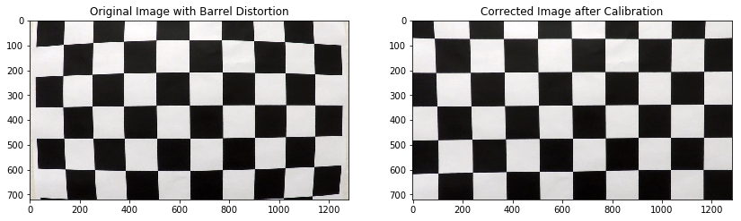

# Advanced Computer Lane Finding 
7-JAN-2021
Implement a video processing pipeline that detects road lanes


## Goals
- Correct image distortion by computing the camera matrix and distortion coefficients
- Enhance lane pixels by applying  color transforms and gradients 
- Apply a perspective transform to rectify image to a to-down view of road.
- Identify lane pixels and fit into a polynomial to represent a lane
- Calculate a radius of curvature and position of vehicle with respect to center
- Compose an image that clearly identifies the lane area
- Fulfill a requirement of the Udacity Self-Driving Car Engineer Nanodegree Program
- Practice using the following: opencv, classes, modules, UML sketching, GRASP, and docstring

## Pipeline Overview
For this project, the pipeline processes each frame of the road video as an individual image by performing the following functions:
- Distortion correction that reduces apparent curvature of straight lines
- Image enhancement that detects edges detection and transforms color values
- Image transformation that results in a top down view of road
- Lane area identification that identifies pixels belonging road lanes
- Image transformation that restores original perspective of lane area
- Recomposing original undistorted image with lane area

The main pipeline is Controller.processImg() in **alf_con.py***
```python
class Controller:
...
    def processImg(self, img):
...
		srch_only           = (self.stage == 3)
	    img_undistorted     = self.cam.undistort(img)
	    binary              = self.enh.enhance(img_undistorted)    
	    binary_warped       = self.war.warpPerspective(binary)
	    lane_area, rad, off = self.alf.paintLaneArea(binary_warped, srch_only)
	    unwarped_lanes      = self.war.unwarpPerspective(lane_area)
	    final_img           = self.hud.compose(img_undistorted, unwarped_lanes, rad, off)
...
```

## Distortion correction
Ensuring that straight lines in the real world appear straight in image space prevents false curves from being processed by later stages of the pipeline.  The opencv function `findChessboardCorners()` was used to calculate object points and image points representing the inner corners of multiple chessboard images. These data were used to  compute the camera matrix and distortion coefficients. Calibration is performed using the opencv function `calibrateCamera()`, then `undistort()` is applied to the image to correct for distortion.

Finding chessboard corners to create objpoints and imgpoints is in `alf_cam.py`:
```python
class ChessboardImage:
...
    def findChessboardCorners(self):
...
        gray = cv2.cvtColor(self.img, cv2.COLOR_RGB2GRAY)
        corners_found, corners = cv2.findChessboardCorners(gray, (self.xdim, self.ydim), flags=None)
        
        if corners_found:
...
            self.objpoints = np.zeros(shape=(self.xdim * self.ydim, 3), dtype=np.float32)
            self.objpoints[:, :2] = np.array([(x, y) for y in range(self.ydim) for x in range(self.xdim)])
	        self.imgpoints = corners
...
        return corners_found
```


Camera calibration is in `alf_cam.py`:
```python
class Camera:
...
    def calibrate(self, calibration_set=None):
...
        if calibration_set is None:
            calibration_set = ChessboardCameraCalibrationSet()
            
        objpoints, imgpoints, self.image_shape = calibration_set.getCalibrationParams ()
        
        #--- rotation and translation vectors not used for this project
        cal_found, self.mtx, self.dist, _, _ = cv2.calibrateCamera(objpoints, 
                imgpoints, self.image_shape, None, None)
...
        return
```




## Image Enhancement
Used sobel function
Color transform; hsv not hsl
combined masks bitwise or
increase sensitivity, lower mins increase max

code here
image here

## Lane pixel identification and line fitting
Subsetion Sliding window search area
Linear window search area
subsection Line fitting using polyfit
 Smoothing

code image


## Radius of curvature and center offset
Used formula
Derive the formula
Center offset using base of line

code here

## Final image composition
original image
unwarping lane area
using openvs to combine image

## Limitations
- Tuned to specific video (lighting weather)
- Glare/blooms
- Sudden curves
- Tight curves
- Dried brush on side of road looks like yellow lane, 
- rail looks like white lane
- mounted internally glare from top dashboard

## Improvements
- Dynamically adjust parameters using histrograms
- Use some kind of A* search for lane pixels where search area is biased in direction of where more pixels are located
- Frame by frame normalization of brightness values
- Glare - use of a polarizing filter, sensor improvements, lens hood
- Hood camera placement
- Bind camera calibration set and image transformation coordinates to the projects


## Other Notes
### Images at each Pipeline Stage

Because the image processed by the function `test_highlight_yellow_and_white()` produced a mask that was already gray scale and not noisy, the pipeline skipped applying a gaussian blur and proceeded with edge detection, Hough transformation, and superimposing the lanes on the final image. Results of applying this shorter pipeline are below:


### Pipeline Limitations

- Lanes exhibit a lot of jitter,
- Lanes that are near-horizontal are not drawn
- Lanes that are near-vertical are not drawn
- Probably will not detect lanes at night or during inclement weather
- Faded lanes will probably not be detected 

### Areas of improvement
- Use theta (angle of incidence of line to horizontal) instead of slope
- Further tweaking parameters
- Including average of previous n-frames in calculating the lane line could help reduce lane jitter
- Collect metrics such as:
	- How many frames did not detect any lines
	- time to process each frame to understand pipeline performance
- Use CNN techniques to identify the lanes
- Draw continuous curve for curved lanes

> Written with [StackEdit](https://stackedit.io/).


> Written with [StackEdit](https://stackedit.io/).