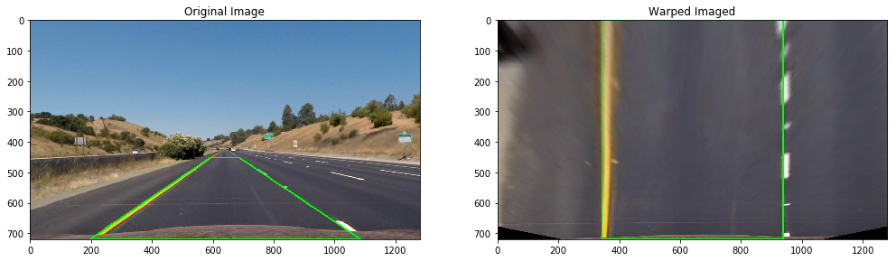

7-JAN-2021
# Advanced Computer Lane Finding 
Implement a video processing pipeline that detects road lanes.

## Table of Contents
- [Goals](#goals)
- [Distortion Correction](#distortion-correction)
  - [Chessboard Corners](#chessboard-corners)
  - [Camera Calibration](#camera-calibration)
- [Image Enhancement](#image-enhancement)
  - [Sobel X-Gradient Masking](#sobel-x-gradient-masking)
  - [HSV Color Masking](#HSV-Color-Masking)
  - [Combining Masks](#Combining-Masks)
- [Top-down View](#top-down-view)
- [Lane Pixel Identification and Line Fitting](#Lane-Pixel-Identification-and-Line-Fitting)
  - [Sliding Window Search Area](#Sliding-Window-Search-Area)
  - [Line Fitting](#Line-Fitting)
  - [Smoothing](#Smoothing)
  - [Sliding Window Search Area Detections](#Sliding-Window-Search-Area-Detections)
  - [Linear Window Search Area](#Linear-Window-Search-Area)
  - [Linear Window Search Area Detections](#Linear-Window-Search-Area-Detections)
  - [Lane Area](#Lane-Area)
- [Radius of Curvature and Center Offset](#radius-of-curvature-and-center-offset)
  - [Scaling Line Coefficients to Real World](#Scaling-Line-Coefficients-to-Real-World)
  - [Center Offset](#Center-Offset)
- [Final image composition](#Final-image-composition)
- [The Pipeline](#The-Pipeline)
  - [Setting Parameters](#setting-parameters)
  - [Pipeline Control and Sequencing](#Pipeline-Control-and-Sequencing)
  - [Project Video](#Project-Video)
  - [Pipeline Struggles with, but Completes, Challenge Video...](#pipeline-struggles-with-but-completes-challenge-video)
  - [...and Fails Miserably on Harder Challenge Video](#and-fails-miserably-on-harder-challenge-video)
- [Limitations, Issues, Challenges](#limitations-issues-challenges)
- [Areas of Improvement](#areas-of-improvement)
    

## Goals
- Correct image distortion by computing the camera matrix and distortion coefficients.
- Enhance lane pixels by applying  color transforms and gradients. 
- Apply a perspective transform to rectify image to a top-down view of road.
- Identify lane pixels and fit into a 2-degree polynomial to represent a lane.
- Calculate a radius of curvature and position of vehicle with respect to center.
- Compose an image that clearly identifies the lane area.
- Fulfill a requirement of the Udacity Self-Driving Car Engineer Nanodegree Program.
- Practice using the following: opencv, classes, modules, UML sketching, GRASP, and docstring.

## Distortion Correction

Ensuring that straight lines in the real world appear straight in image space prevents false curves from being processed by later stages of the pipeline.

### Chessboard Corners

The opencv function `findChessboardCorners()` was used to calculate object points and image points representing the inner corners of multiple chessboard images:


```python
###
### Code location: alf_cam.py
###

class ChessboardImage:

    # ...
    
    def findChessboardCorners(self):

        # ...
        
        gray = cv2.cvtColor(self.img, cv2.COLOR_RGB2GRAY)
        corners_found, corners = cv2.findChessboardCorners(gray, (self.xdim, self.ydim), flags=None)
        
        if corners_found:
        
            # ...
            
            self.objpoints = np.zeros(shape=(self.xdim * self.ydim, 3), dtype=np.float32)
            self.objpoints[:, :2] = np.array([(x, y) for y in range(self.ydim) for x in range(self.xdim)])
	        self.imgpoints = corners
            
            # ...
            
        return corners_found
```

Image below verifies the chessboard corners found:


### Camera Calibration

The objpoints and imgpoints data were used to compute the camera matrix and distortion coefficients. Calibration is performed using the opencv function `calibrateCamera()`, then `undistort()` is called in the main pipeline which performs the actual distortion correction:

```python
###
### Code location: alf_cam.py
###

class Camera:

    # ...
    
    def calibrate(self, calibration_set=None):

        # ...
    
        if calibration_set is None:
            calibration_set = ChessboardCameraCalibrationSet()
            
        objpoints, imgpoints, self.image_shape = calibration_set.getCalibrationParams ()
        
        #--- rotation and translation vectors not used for this project
        cal_found, self.mtx, self.dist, _, _ = cv2.calibrateCamera(objpoints, imgpoints, self.image_shape, None, None)
        
        # ...
        
        return
        
        # ...	
        
    def undistort(self, img):
        img_undist = cv2.undistort(img, self.mtx, self.dist)
        return img_undist	
```

Image below verifies camera calibration. The apparent curve of straight lines due to lens distortion is corrected to appear straight in the output image:


## Image Enhancement
Edge detection and color transformation is applied to the image corrected for distortion. Combining Sobel X-gradient and color space masks help pickout yellow and white lanes. 

### Sobel X-Gradient Masking

The Sobel function helped with detecting lanes in low contrast areas where the lightness of the road was similar to the lightness of the lanes.  

```python
###
### Code location: alf_enh.py
###

class Enhancer:

    # ...
    
    def sobelXMask(self, img):
        gray = cv2.cvtColor(img, cv2.COLOR_RGB2GRAY)
        sobel = np.absolute(cv2.Sobel(gray, cv2.CV_64F, dx=1, dy=0))
        sobel_scaled = np.uint8(255 * sobel / np.max(sobel))
       
        mask = np.zeros_like(sobel_scaled)
       
        # activate (set to "1") all pixels that meet the x gradient thresholds
        mask[(self.sob_min_x <= sobel_scaled) & (sobel_scaled <= 255)] = 1
       
        return mask
```

### HSV Color Masking

The color transforms were done in the HSV colorspace because the image editing tools used to idenfity the color values worked in the HSV space. Yellow and white lane masks are combined with a bitwise OR:

```python
###
### Code location: alf_enh.py
###

class Enhancer:

    # ...

    def laneMask(self, img):
        hsv = cv2.cvtColor(img, cv2.COLOR_RGB2HSV)

        h = hsv[:,:,0] # h-channel
        s = hsv[:,:,1] # s-channel
        v = hsv[:,:,2] # v-channel

        # mask for yellow lane
        y_mask = np.zeros_like(s)
        y_h = (10 <= h) & (h <= 25)
        y_s = s > self.y_min_s
        y_v = v > self.y_min_v
        y_mask [(y_h & y_s & y_v)] = 1

        # mask for white lane
        w_mask = np.zeros_like(s)
        w_s = s < self.w_max_s
        w_v = self.w_min_v < v
        w_mask[(w_s & w_v)] = 1

        return y_mask | w_mask
```

### Combining Masks

The sobel x-gradient mask is combined with the lane mask with bitwise AND: 

```python
### 
### Code location: alf_enh.py:
###

class Enhancer:
    
    # ...
    
    def enhance(self, img):
        sobel_mask = self.sobelXMask (img)
        lane_mask = self.laneMask(img)       
        return sobel_mask & lane_mask
```

If edge detection was not performed, the image would look like random noise in those low contrast, similarly colored areas. If the sobel mask was combined using a bitwise OR, we would get additional noise that would make it difficult for the later stages to pickout the lane. Keeping a low edge detection threshold helped pick out the lanes where the values and saturation of the white lanes were similar with light colored concrete:


## Top-down View
The perspective of the road area is transformed to a top-down view prior to lane pixel search and detection. To select the region, an undistorted image of a straight section of road is taken, and a line was drawn with an image editor to coincide with one of the straight lanes. The other line is derived from taking the inverse slope of the first and the four points of the trapezoid are then read from the image editor. In the actual pipeline, the trapezoidal region is transformed after the edge detection and color transformation masks are applied. A rectangular region is then plotted to which the trapezoid is transformed:



The trapezoidal region of the source image and the rectangular region of the destination is used to compute the perspective transformation matrix, `M`, to achieve a top down view using opencv's `warpPerspective()`. Its inverse, `invM`, is used to transform the top down view back into the original perspective on the road image using `unwarpPerspective()` in the final stage of the pipeline:

```python
###
### Code location: alf_enh.py
### 

class Warper:
    
    # ...
    
    def calibrate(self):
        # M: transformation matrix
        self.M = cv2.getPerspectiveTransform(self.calibration_set.src_points, 
                                            self.calibration_set.dst_points)
        # use invM when unwarping image
        self.invM = cv2.getPerspectiveTransform(self.calibration_set.dst_points, 
                                                self.calibration_set.src_points)
        return

    def warpPerspective(self, img):
        img_warped = cv2.warpPerspective(img, self.M, 
              (img.shape[1], img.shape[0]), 
              flags=cv2.INTER_LINEAR)
        return img_warped
    
    def warpPerspective(self, img):
        img_unwarped = cv2.warpPerspective(img, self.invM, 
             (img.shape[1], img.shape[0]), 
             flags=cv2.INTER_LINEAR)
        return img_unwarped
```

## Lane Pixel Identification and Line Fitting

A "sliding window" search area and, when a line was successfully found in a previous frame, a "linear window" was used to gather pixels associated with a lane. It used the top down binary image from the warp (perspective transformation) stage to identify lane pixels.

### Sliding Window Search Area

The "sliding window" search area defined a rectangle, `(SlidingWindow.x1, SlidingWindow.y1, SlidingWindow.x2, SlidingWindow.y2)`, which starts at the base of the image and progressively "slides" up the image to gather lane pixels within the boundaries of the rectangle. The lane pixels are gathers in separate x and y position arrays `SlidingWindow.lane_points_x` and `SlidingWindow.lane_points_y`. The horizontal (`SlidingWindow.x_mid`) position of the rectangle is adjusted to the average x position of all pixels found if a threshold number of points was reached. Also, if not enough pixels were found the window is slid in the last direction of found pixels so that it just does not slide upwards. Rather, it slides in the direction the previous window slid. Windows can slide past the left or right edges. The sliding stops once it reaches the top (set in boolean variable `SlidingWindow.passed_top` in `SlidingWindow.slideUp()`).  

```python
###
### Code location: alf_llg.py
###

class SlidingWindow:

    # ...
    
    def findPoints(self):
   
        while not self.passed_top:        
           
            self.window_history.append([self.x1, self.y1, self.x2, self.y2])
           
            # mask in all points within window by x and y values
            x_bool_mask = (self.x1 <= self.image_points_x) & (self.image_points_x <= self.x2)
            y_bool_mask = (self.y1 <= self.image_points_y) & (self.image_points_y <= self.y2)

            # bit wise the x and y masks to get the actual points
            xy_bool_mask = (x_bool_mask) & (y_bool_mask)

            # apply mask to image_points_x and _y to find the points that are in window region
            points_found_x = self.image_points_x[xy_bool_mask]
            points_found_y = self.image_points_y[xy_bool_mask]

            # collect the points found into lane_points_x and _y
            self.lane_points_x.extend(points_found_x)
            self.lane_points_y.extend(points_found_y)

            # update the midpoint if enough points found above threshold
            if len(points_found_x) >= self.numpoints_found_thresh:
                new_x_mid = np.int(np.average(points_found_x))
                self.x_dir = new_x_mid - self.x_mid
                self.x_mid = new_x_mid
            elif (len(points_found_x) < self.numpoints_found_thresh // 3 and self.x_dir is not None):
                self.x_mid += self.x_dir

            self.slideUp()
       
        return (self.lane_points_x, self.lane_points_y)
```

### Line Fitting

The lane points in separate x and y arrays are then used to find a line (in terms of the second degree polynomial coefficients) that best represents the lane using numpy's `polyfit()`:

```python
###
### Code location: alf_llg.py
###

class Line:

    # ...
    
    def fit(self, x_points, y_points):
        self.pts = None    
        self.x = None
        self.y = None 
        self.found = False 
        tries = 0
        max_tries = 3
        while tries < max_tries and not self.found:
            tries += 1
            try:
                # remember we solve for X!!! i.e. x = ay^2 + by + c
                coeffs = np.polyfit(y_points, x_points, deg=2)
                if tries > 1:
                    msg = "Polyfit succeeded on try {}."
                    self.logger.debug(msg.format(tries))
                self.found = True
            
            except Exception as e:
                if tries < max_tries:
                    msg = "Polyfit failed: {}. Trying again."
                    self.logger.debug(msg.format(e))
                else:
                    msg = "Polyfit failed to fit a line. {}."
                    self.logger.debug(msg.format(e))
                    
        if self.found:
            self.coeffs = coeffs
        else:
            self.coeffs = None
            
        return
```

### Smoothing

Once a fit has been determined, the line goes through a smoothing process which adjusts the coefficients to a weighted average of previous coefficients. If the fit is not within a specified `N` standard deviations of the average of previous coeffs, the most recent set of coefficients is used for the current line:

```python
###
### Code location: alf_llg.py
###

class Line:

    # ...
    
    def smooth (self):
        
        good_fit = False
        
        if self.prev_coeffs:
            
            avg_prev_coeffs = np.average(self.prev_coeffs, axis=0)
            
            if self.found:
                
                if len (self.prev_coeffs) > self.min_samples:
                    # see if coeff of line is within std devs of avg 
                    # of previous lines 
                    std_prev_coeffs = np.std(self.prev_coeffs, axis=0)
                    in_range = (abs(self.coeffs - avg_prev_coeffs) 
                               < self.N*std_prev_coeffs)
                else:
                    in_range = [True]
                    
                good_fit = all (in_range)

                if good_fit:
                    self.logger.debug("Line fit seems ok.")
                    # coeffs use avg prev coeffs based on bias
                    # set coeff bias to 1 to prevent bias from prev coeffs
                    self.coeffs = (self.coeff_bias*self.coeffs
                                  + (1-self.coeff_bias)*avg_prev_coeffs)
                    self.prev_coeffs.append(self.coeffs) 
                    if len(self.prev_coeffs) > self.max_coeffs:
                        # pop first to remove oldest line from list to 
                        # prevent being include in average
                        self.prev_coeffs.pop(0)
                        msg = "Coeff buffer full:{}. Removed oldest line."
                        self.logger.debug(msg.format(len(self.prev_coeffs)))
                
                else:
                    self.logger.debug("Line fit looks off; "
                        + "will use average of previous.")
                    self.coeffs = avg_prev_coeffs
                    # set found to False since line fit was bad
                    # remove oldest line; allows list of previous fits
                    # to decay to nothing if consecutive bad lines are
                    # are found
                    self.prev_coeffs.pop(0)
                    
            else:
                # line not found, use average of previous coffecients 
                self.logger.debug("Line was not found! "
                    + "Using average of old lines.")
                self.coeffs = avg_prev_coeffs                
                self.prev_coeffs.pop(0)
                # set found to True since we "found" a line 
                # using the average of previous coeffs
                
        elif self.found:
            # first coeff to add to list! 
            good_fit = True
            # don't smooth since there is nothing to smooth to
            self.prev_coeffs.append(self.coeffs) 
            
        msg = "Number of old lines/coeffs: {}."
        self.logger.debug(msg.format(len(self.prev_coeffs)))
            
        return good_fit
```

### Sliding Window Search Area Detections

The coefficients of the line can then be used to represent the real world lane. Below is an example of the sliding windows (green), detected pixels (yellow and blue), and lane lines (red):


### Linear Window Search Area

If a line has been found in a previous frame, a linear window search area is used. The borders of the search area are simply  offsets to either side of the line, `(LinearWindow.x1, LinearWindow.x2)`. Pixels are simply gathered into `LinearWindow.lane_points_x` and `LinearWindow.lane_points_y` for those that are within these linear borders:

```python
### 
### Code location: alf_llg
###

class LinearWindow:
    
    def findPoints (self):
        
        # mask in all points within linear window by x values
        x_bool_mask = (self.x1 <= self.image_points_x) & (self.image_points_x <= self.x2)
        
        # apply mask to image_points_x and _y to find the points 
        # that are in linear window search area 
        points_found_x = self.image_points_x[x_bool_mask]
        points_found_y = self.image_points_y[x_bool_mask]
        
        # collect the points found into lane_points_x and _y
        self.lane_points_x.extend(points_found_x)
        self.lane_points_y.extend(points_found_y)
        
        # the x coordinates of the line may be modified after line smoothing
        # and may not reflect the original search area
        # so save the x coordinates after find findpoints for use in paint
        self.x_search_line = [self.line.lookupX(y) for y in range(self.ht)]
        
        return self.lane_points_x, self.lane_points_y    
```

### Linear Window Search Area Detections

Below is an example of the linear windows search areas, the borders on each side (green), lane pixels detected within those borders (yellow and blue), and the lines representing the lanes (red):


### Lane Area

With both lane lines detected, an enclosed "polygon" is formed which is filled to highlight the lane area. This top down view of the lane area will then be restored to a its proper perspective and blended into the original image of the road.


## Radius of Curvature and Center Offset

To calculate the radius of curvature, the suggestion in *Lesson 8 - Measuring Curvature II*. The advantage of using the method suggested is allows the pipeline to skip doing another line fit of xy coordinates scaled to real world coordinates in order to solve for the real world values of the coefficients. Real world line coefficients can be derived from the existing coefficients in the pixel space (scale to meters from pixels) without the need for doing another line fit.

### Scaling Line Coefficients to Real World

The goal is to find `a_mtr`, `b_mtr`, `c_mtr` (real world coefficients) in terms of corresponding values in pixel space (`a_pix`, `b_pix`, `c_pix`) and scaling factors (`mx`, `my`).

The line in the real world scale is:
```
x_mtr = a_mtr*(y_mtr)**2 + b_mtr*y_mtr + c_mtr
```

Scaling real world coordinates from pixels coordinates is given by
```
y_mtr = my * y_pix  =>  y_pix = y_mtr/my
x_mtr = mx * x_pix  =>  x_pix = x_mtr/mx
```

The line in pixel space is:
```
x_pix = a_pix*(y_pix)**2 + b_pix*y_pix + c_pix
```

Substitute `x_pix` and `y_pix` with their real world values `x_mtr` and `y_mtr`:
```
x_mtr/mx = a_pix*(y_mtr/my)**2 + b_pix*(y_mtr/my) + c_pix
```

Arrange the y-scale factor, `my`:
```
x_mtr/mx = (a_pix/my**2)*(y_mtr)**2 + (b_pix/my)*(y_mtr) + c_pix
```

Multiply both sides by `mx` to solve for `x_mtr`:
```
x_mtr = mx*((a_pix/my**2)*(y_mtr)**2 + mx*(b_pix/my)*(y_mtr) + mx*c_pix
```

Arrange the x-scale factor, `mx`:
```
x_mtr = (a_pix*mx/my**2)*(y_mtr)**2 + (b_pix*mx/my)*(y_mtr) + mx*c_pix
```

Recall that the line in real world scale is...: 
```
x_mtr = a_mtr*(y_mtr)**2 + b_mtr*y_mtr + c_mtr
```

...then the coefficients in real_world (a_mtr, b_mtr, c_mtr) can be scaled in terms of their corresponding pixel coefficients using the following:
```
a_mtr = a_pix*mx/(my**2)
b_mtr = b_pix*mx/my
c_mtr = c_pix*mx
```

So scaling the pixel coefficients to real world coefficients can now be implemented, whilst skipping another call to `polyfit()` (note we use the scaling factors, `XM_PER_PIXEL = 3.7/700` and `YM_PER_PIXEL = 30/720`, presented in the lesson.

```python
###
### Code location: alf_llg.py
###

# image to real space scaling default per lesson Measuring Curvature II
# in meters per pixel; used in calculating radius of curvature
# as well as offset center
XM_PER_PIXEL = 3.7 / 700    
YM_PER_PIXEL = 30 / 720


class Line:

    # ...

    def radius(self, y, xm_per_pix=None, ym_per_pix=None):
        if not self.found:
            return None
        try:
            # rescale coeffs and y to real world
            a = self.coeffs[0] * xm_per_pix / ym_per_pix**2
            b = self.coeffs[1] * xm_per_pix / ym_per_pix
            y = y * ym_per_pix    # scale y to real-world!
            R = (1 + (2*a*y + b)**2)**(3/2) / abs(2*a)
            msg = "Radius of curvature: {}."
            self.logger.debug(msg.format(R))
        except Exception as e:
            msg = "Error in calculating radius of curvature: {}."
            self.logger.warning(msg.format(e))
            R = None
        return R
```

### Center Offset

The x-coordinate of each line at the base of the image, `Line.baseX()`, is used to calculate the center x-coordinate between the two lanes, `lane_center`. It is then subtracted by the center coordinate of the screen, `img_ctr`, to calculate the offset of the vehicle from center line (scaled from pixel to real world space using `XM_PER_PIXEl`).

```python
###
### Code location: alf_llg.py
###
class Line

    # ...

    def baseX(self):
        '''
        Returns the x coordinate of the "base" of the line; i.e. at the bottom of image.
        
        Notes:
        - Used in calculating offset from center for the lane finder
        - Call generateXY() before calling this
        - returns none if no line was found
        '''
        
        if not self.found:
            return None
            
        return self.x[-1]


class AdvancedLaneFinder:

    def centerOffset(self):
        
        img_ctr = self.binary_warped.shape[1] // 2
        
        t = 0    # sums up x values
        n = 0    # count of number of samples

        # get distance from center
        x_left =  self.left_lane_line_finder.baseX()
        t  += x_left if x_left is not None else 0
        n  += 1 if x_left is not None else 0
        
        x_right = self.right_lane_line_finder.baseX()
        t  += x_right if x_right is not None else 0
        n  += 1 if x_right is not None else 0
        
        if n > 0:
            lane_center = t / n
            self.center_offset = (lane_center - img_ctr) * XM_PER_PIXEL
        else:
            self.center_offset = None
            
        msg = "Center offset: {}."
        self.logger.debug(msg.format(self.center_offset))
            
        return self.center_offset 

```

## Final image composition

Because the lane area is in the top down perspective, the `Controller` reuses the `Warper` component to unwarp the lane area. 

```python
###
### Code location: alf_con.py 
###

class Controller:

    # ...
    
    def processImg(self, img):
    
        # ...
        
        unwarped_lanes      = self.war.unwarpPerspective(lane_area)
        final_img           = self.hud.compose(img_undistorted, unwarped_lanes, rad, off)
        
        # ...
```

```python
###
### Code location: alf_war.py
###

class Warper:

    # ...

    def unwarpPerspective(self, img):
        
        img_unwarped = cv2.warpPerspective(img, self.invM, 
                (img.shape[1], img.shape[0]), 
                flags=cv2.INTER_LINEAR)
        
        return img_unwarped
```

The `Controller` then uses `HUD` (for Heads Up Display) component to blend the "unwarped" lane area with the original *undistorted* image, and write the radius of curvature and center offset onto the image.

```python
###
### Code location: alf_hud.py
###

class HUD:

    # ...
    
    def blendImages(self, img_undistorted, unwarped_lanes):
        
        self.img_lane_area = cv2.addWeighted(img_undistorted, 
                                             alpha = 1.0, 
                                             src2  = unwarped_lanes, 
                                             beta  = 0.3, 
                                             gamma = 0.0)
        
        return
    
    def putRadius(self, rad):
    
        radius = rad
        if radius is None:
            rad_str = "Radius:"
        elif radius >= 2000: 
            # we'll use around 2km for a road that feels straight
            # min curve radius with superelevation 80mph 4575ft ~1.4km
            # per U.S. government specifications for highway curvature: 
            # link: https://tinyurl.com/y42ulukp
            rad_str = "On straightaway"
        else:
            msg = "Radius: {:.2f} km"
            rad_str = msg.format (radius / 1000)
        
        cv2.putText(self.img_lane_area, rad_str, (50, 50), self.font, self.scale, self.color, self.thickness)
        
        return
        
    def putCenterOffset(self, off):
        
        center_offset = off
        if center_offset is None:
            off_str = "Center offset "
        else:
            if abs (center_offset) < 0.1:  #--- 0.1 m or 10 cm
                #--- if it's within 10cm it's on centerline...comeon!!!!
                off_str = "Roughly on centerline!"
            else:
                if center_offset > 0:
                    msg = "Center Offset: {:.0f} cm Left"
                else:
                    msg = "Center Offset: {:.0f} cm Right"
                off_str = msg.format (abs(center_offset * 100))
        
        cv2.putText(self.img_lane_area, off_str, (50, 100), self.font, self.scale, self.color, self.thickness)
        
        return
    
    def compose(self, img_undistorted, unwarped_lanes, rad, off):
        
        self.blendImages(img_undistorted, unwarped_lanes)
        
        self.putRadius(rad)
        self.putCenterOffset(off)
        
        return self.img_lane_area
```

The lane area, radius of curvature, center offset, and the original image are combined to compose the final image. 


## The Pipeline

The project video output is here: [project_video.mp4](./output_images/project_video.mp4)

The pipeline processes each frame of the road video as an individual image by performing the following functions mentioned in the previous sections:
- Distortion correction that reduces apparent curvature of straight lines
- Image enhancement that detects edges detection and transforms color values
- Image transformation that results in a top down view of road
- Lane area identification that identifies pixels belonging road lanes
- Another image transformation that restores the top-down view of the lane area to the original perspective
- Composing the original undistorted image with lane area, radius of curvature, and center offset

### Setting Parameters

The parameters for the `Enhancer` and `AdvancedLaneFinder` must be set with `Controller.setParams()` before using the `Controller` to process each image. The parameters are specificed in a dict with values described in the comments of the code block below.

```python
#
# Code location: alf_con.py
#

Class Controller:

    # ...

    def setParams(self, params):
        '''
        Sets tunable parameters for pipeline.
        
        Params:
        - params: a dict that the following keys used to set parameters
        for enhancer and advanced lane finder:
            'sob_min_x'   : minimum sobel x gradient threshold
            'y_min_s'     : min saturation (hsv) for yellow lane
            'y_min_v'     : min value (hsv) for yellow lane
            'w_max_s'     : MAX saturation (hsv) for white lane
            'w_min_v'     : min value (hsv) for white lane
            'max_coeffs'  : num prev coeffs (lines) to keep for smoothing
            'min_samples' : num of lines needed to start smoothing
            'N'           : num of std devs from mean to consider a good fit
            'coeff_bias'  : amount of bias (0 to 0.99) for current  line
            'clip_start'  : time to start processing clip
            'clip_end'    : tome to end processing clip
            'stage'       : stage of pipeline to output  (1..5)
            'output'      : filename of output file
            
        Notes:
        - Default params for project_video.mp4:
        
            project_video = {
                'filename'   : 'project_video.mp4',
                'sob_min_x'  : 40,
                'y_min_s'    : 57,
                'y_min_v'    : 220,
                'w_max_s'    : 25,
                'w_min_v'    : 201,
                'max_coeffs' : 50,
                'min_samples': 3,
                'N'          : 12,
                'coeff_bias' : 0.9,
                'clip_start' : None,
                'clip_end'   : None,
                'stage'      : 5,
                'output'     : 'project_video.mp4'
            }
        '''
    
        self.filename = params['filename']
        
        self.enh.setParams(
                sob_min_x = params['sob_min_x'], 
                y_min_s   = params['y_min_s'], 
                y_min_v   = params['y_min_v'], 
                w_max_s   = params['w_max_s'], 
                w_min_v   = params['w_min_v'])
            
        self.alf.setParams(
                max_coeffs  = params['max_coeffs'], 
                min_samples = params['min_samples'], 
                N           = params['N'], 
                coeff_bias  = params['coeff_bias'])
                
        self.start  = params['clip_start']
        self.end    = params['clip_end']
        self.stage  = params['stage']
        self.output = params['output']
                
        return
```

### Pipeline Control and Sequencing

A `controller` coordinates and sequences the various components of the pipeline in the main processing methond `Controller.processImsg():

```python
###
### Code location: alf_con.py 
###

class Controller:

    # ...
    
    def processImg(self, img):
    
        # ...
        
        srch_only           = (self.stage == 3)
        img_undistorted     = self.cam.undistort(img)
        binary              = self.enh.enhance(img_undistorted)    
        binary_warped       = self.war.warpPerspective(binary)
        lane_area, rad, off = self.alf.paintLaneArea(binary_warped, srch_only)
        unwarped_lanes      = self.war.unwarpPerspective(lane_area)
        final_img           = self.hud.compose(img_undistorted, unwarped_lanes, rad, off)
        
        # ...
        
```

### Project Video

The pipeline appears to have succesfully identified the lane area and is located in the `output_images` folder with filename `project_video.mp4`: [output_images/project_video.mp4](./output_images/project_video.mp4)


### Pipeline Struggles with, but Completes, Challenge Video...
The pipeline also appears to have succesfully worked on the challenge video. The output is located here: [output_images/challenge_video.mp4](output_project/challenge_video.mp4)


### ...and Fails Miserably on Harder Challenge Video
The tight curves, brush and trees on either side of the road, dashboard glare, varied lighting conditions, and traffic were some of the challenges that prevented the pipeline from consistently detecting the lanes in the hard challenge video:  [output_images/challenge_video.mp4](output_project/challenge_video.mp4)


## Limitations, Issues, Challenges
- Varied lighting conditions made it a challenge to find good HSV values that would help the pipeline detect lanes in all frames.
- Dashboard glare detrimentally affects performance.
- Camera lens aperture changes detrimentally affects performance (aperture appears to change from shadow area to light area).
- There is no universal set of pipeline parameters. The pipeline parameters are tuned to a specific video. So the pipeline parameters for one video may not work on another.
- Pipeline will fail on sudden, tight curves. 
- It will struggle on extended light colored roads; dried brush on side of road will fool pipeline into thinking it is a lane; guardrail on side of road looks like white lane.
- Bumpy roads (such as going over a brdige) will change the perspective of the road and may make the lanes either coverge or diverge.

## Areas of Improvement
- Investigate use of CNN/YOLO to identify lane and edges of lane (and traffic!).
- Change algorithm to search front area of vehicle and search outward to sides until a "road border" is reached to identify the left and right limits of the road.
- Dynamically adjust pipeline parameters. Perhaps take the histogram of the bottom half of frame and stretch the HSV values to achieve better color, light and shadow separation.
- Use some kind of A* search for lane pixels where search area is biased in direction of where more pixels are located.
- Sensor-related: Use of a polarizing filter on camera to help with glare. Use constant aperture (don't go full auto on camera); mount camera on front of car sensor improvements; use lens hood; use some kind of 3-axis stabilization for sensor
- Creating a virtual test track (ex: on Unreal Studio) will allow experimenting with perfect conditions to progressively worse conditions and may be a cost effective approach in further researching lane detecting algorithms.